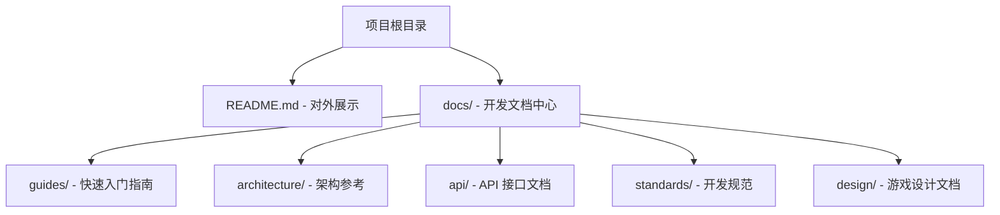
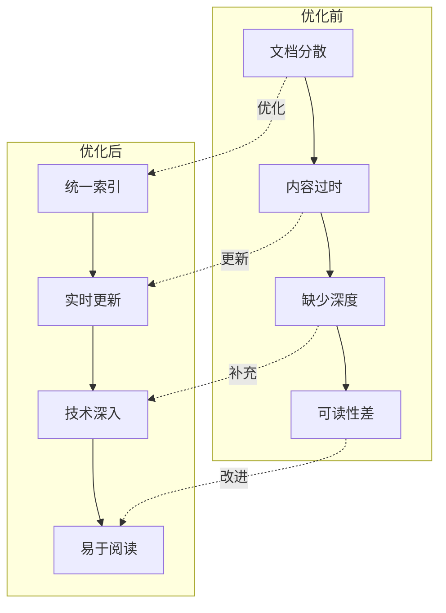
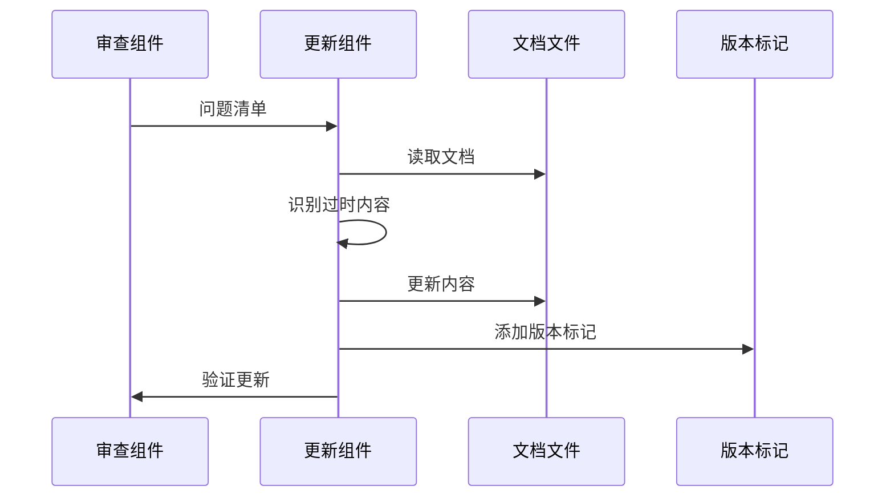
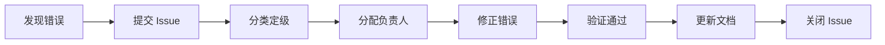

# 项目文档内容质量优化设计方案

需求名称：document-optimization
更新日期：2026-04-17

## 描述

本项目旨在对修仙挂机游戏项目的现有文档进行全面的内容质量优化。当前项目已在 `/workspace/docs/` 目录下建立了较为完善的文档体系，但存在内容时效性不足、部分内容缺失、技术深度不够、可读性有待提升等问题。

本次优化将对文档内容进行全面审查和改进，确保文档能够准确反映当前代码状态、提供充足的技术细节、具备良好的阅读体验，从而提高开发效率和代码质量。

## 架构

### 文档体系现状



### 优化架构图



## 组件和接口

### 1. 文档审查组件

**职责**：系统性审查现有文档，识别质量问题

**输入**：
- 现有文档文件（Markdown 格式）
- 当前代码库
- 历史需求规格文档

**输出**：
- 问题清单（按优先级分类）
- 优化建议
- 影响范围评估

**审查维度**：

| 维度 | 检查项 | 权重 |
|------|-------|------|
| **时效性** | API 接口是否与代码一致<br>配置示例是否可执行<br>引用链接是否有效 | 30% |
| **完整性** | 是否缺少使用说明<br>是否缺少示例代码<br>是否缺少错误处理说明 | 25% |
| **准确性** | 技术描述是否准确<br>代码示例是否可运行<br>数值参数是否正确 | 25% |
| **深度** | 是否有原理说明<br>是否有架构决策背景<br>是否有性能分析 | 10% |
| **可读性** | 排版是否清晰<br>图表是否恰当<br>语言是否简洁 | 10% |

### 2. 文档更新组件

**职责**：根据审查结果更新文档内容

**工作流程**：



**更新策略**：

1. **自动检测**：通过代码分析识别 API 变更
2. **半自动更新**：生成更新建议，人工确认
3. **手动修订**：复杂内容人工编写
4. **版本标记**：每次更新标注日期和版本

### 3. 内容补充组件

**职责**：识别并补充缺失的文档内容

**补充范围**：

| 文档类型 | 需补充内容 | 优先级 |
|---------|----------|-------|
| API 文档 | 请求/响应示例<br>错误码详细说明<br>调用频率限制 | 高 |
| 架构文档 | 架构演进历史<br>技术选型理由<br>性能基准数据 | 高 |
| 开发指南 | 常见问题 FAQ<br>最佳实践案例<br>典型错误示例 | 中 |
| 设计规范 | 代码示例<br>反模式说明<br>自动化检查规则 | 中 |
| 游戏设计 | 数值平衡公式<br>关卡设计参数<br>剧情分支图 | 低 |

### 4. 可读性优化组件

**职责**：改进文档排版、语言和视觉呈现

**优化内容**：

1. **统一模板**
   - 文档标题格式
   - 章节编号规则
   - 代码块语法高亮
   - 表格样式规范

2. **图表增强**
   - 架构图 Mermaid 图表
   - 流程图
   - 时序图
   - ER 关系图

3. **语言优化**
   - 简化冗长句子
   - 统一术语翻译
   - 消除歧义表述
   - 增加过渡语句

4. **导航改进**
   - 目录索引
   - 内部链接
   - 面包屑导航
   - 相关文档推荐

## 数据结构

### 文档质量评估模型

```json
{
  "document_id": "string",
  "file_path": "string",
  "category": "guide|architecture|api|standard|design",
  "quality_score": {
    "timeliness": 0.0,
    "completeness": 0.0,
    "accuracy": 0.0,
    "depth": 0.0,
    "readability": 0.0,
    "overall": 0.0
  },
  "issues": [
    {
      "type": "outdated|missing|incorrect|shallow|unclear",
      "severity": "critical|major|minor",
      "location": {
        "section": "string",
        "line": 0
      },
      "description": "string",
      "suggestion": "string"
    }
  ],
  "update_history": [
    {
      "date": "yyyy-mm-dd",
      "version": "string",
      "changes": ["string"]
    }
  ]
}
```

### 问题追踪数据库

| 字段 | 类型 | 说明 |
|------|------|------|
| issue_id | STRING | 问题唯一标识 |
| document_path | STRING | 文档路径 |
| issue_type | ENUM | outdated/missing/incorrect/shallow/unclear |
| severity | ENUM | critical/major/minor |
| description | TEXT | 问题描述 |
| suggestion | TEXT | 优化建议 |
| status | ENUM | pending/in_progress/resolved |
| assignee | STRING | 负责人 |
| created_date | DATE | 创建日期 |
| resolved_date | DATE | 解决日期 |

## 正确性属性

### 一致性保证

1. **代码与文档一致性**
   - API 文档中的接口签名必须与代码一致
   - 配置示例必须可执行
   - 错误码必须与 ErrorCode 枚举一致

2. **文档间一致性**
   - 跨文档引用必须准确
   - 术语使用必须统一
   - 数值参数必须一致

3. **版本一致性**
   - 文档必须标注适用版本
   - 历史版本变更必须有记录
   - 废弃内容必须有标记

### 验证方法

1. **自动化检查**
   ```bash
   # 检查 API 文档与实际接口的一致性
   python scripts/validate-api-docs.py
   
   # 检查代码示例是否可运行
   python scripts/validate-code-examples.py
   
   # 检查链接是否有效
   python scripts/validate-links.py
   ```

2. **人工审查**
   - 技术负责人审查架构文档
   - API 作者审查接口文档
   - 开发者交叉审查开发指南

3. **持续集成**
   - PR 必须包含文档更新（如适用）
   - 文档编译无警告
   - 链接检查通过

## 错误处理

### 文档错误分类

| 错误类型 | 处理方式 | 响应时间 |
|---------|---------|---------|
| **严重错误**<br>（导致代码无法运行） | 立即修正<br>发布更正公告 | 24 小时内 |
| **主要错误**<br>（技术方案有误） | 优先修正<br>通知相关开发者 | 3 天内 |
| **次要错误**<br>（拼写、排版等） | 批量修正<br>定期更新 | 1 周内 |

### 错误报告流程



### 版本回滚机制

如果文档更新引入大量错误，启用回滚：

1. Git 回滚到上一版本
2. 通知所有开发者
3. 重新审查更新内容
4. 修正后重新发布

## 测试策略

### 文档测试方法

1. **可执行性测试**
   - 验证所有命令示例可执行
   - 验证所有配置示例可加载
   - 验证所有 API 示例可调用

2. **链接完整性测试**
   ```bash
   # 使用 markdown-link-check 工具
   npx markdown-link-check docs/**/*.md
   ```

3. **一致性测试**
   - 对比 API 文档与实际代码
   - 对比架构图与实际包结构
   - 对比错误码文档与实际枚举

4. **用户测试**
   - 新开发者按照文档操作
   - 记录卡顿点和疑惑点
   - 优化表述不清的内容

### 验收标准

| 指标 | 目标值 | 测量方法 |
|------|-------|---------|
| API 文档准确率 | ≥ 98% | 抽样检查 |
| 代码示例可运行率 | 100% | 自动化测试 |
| 链接有效率 | ≥ 95% | 工具扫描 |
| 文档覆盖率 | ≥ 90% | 代码功能点/文档功能点 |
| 开发者满意度 | ≥ 4.5/5.0 | 问卷调查 |

### 质量门禁

```yaml
quality_gates:
  api_accuracy:
    min: 95
    critical: true
  code_examples_runnable:
    min: 100
    critical: true
  links_valid:
    min: 90
    critical: false
  content_freshness:
    max_age_days: 90
    critical: false
  developer_satisfaction:
    min: 4.0
    critical: false
```

## 引用链接

[^1]: [Docsify 文档系统](https://docsify.js.org/) - 轻量级文档站点生成器
[^2]: [Markdown 风格指南](https://markdown.com.cn/) - Markdown 编写规范
[^3]: [代码审查改进方案](./docs/standards/CODE-REVIEW-IMPROVEMENT-PLAN.md) - 现有代码审查机制
[^4]: [后端架构总览](./docs/architecture/BACKEND-ARCHITECTURE.md) - 当前架构文档
[^5]: [API 总览与通用规范](./docs/api/API-OVERVIEW.md) - API 文档入口

---

## 附录：实施计划

### 阶段 1：审查与评估（1 周）

| 任务 | 负责人 | 交付物 |
|------|-------|-------|
| 扫描所有文档 | 自动化工具 | 文档清单 |
| 质量评估打分 | 审查组件 | 质量报告 |
| 问题分类整理 | 审查组件 | 问题清单 |
| 优先级排序 | 技术负责人 | 优化路线图 |

### 阶段 2：内容更新（2-3 周）

| 任务 | 负责人 | 交付物 |
|------|-------|-------|
| API 文档更新 | API 作者 | 更新后的 API 文档 |
| 架构文档更新 | 架构师 | 更新后的架构文档 |
| 示例代码补充 | 开发者 | 完整的代码示例 |
| 错误信息修正 | 原作者 | 准确的描述 |
| 技术深度补充 | 技术负责人 | 原理说明和决策背景 |

### 阶段 3：可读性优化（1 周）

| 任务 | 负责人 | 交付物 |
|------|-------|-------|
| 模板统一 | 文档维护者 | 统一模板 |
| 图表制作 | 架构师 | Mermaid 图表 |
| 语言润色 | 文档维护者 | 优化后的文字 |
| 导航优化 | 文档维护者 | 完善的索引 |

### 阶段 4：验证与发布（3 天）

| 任务 | 负责人 | 交付物 |
|------|-------|-------|
| 自动化测试 | 测试工具 | 测试报告 |
| 人工审查 | 技术负责人 | 审查意见 |
| 问题整改 | 原作者 | 修正后的文档 |
| 发布上线 | 文档维护者 | 新版文档 |

### 阶段 5：持续改进（持续）

| 任务 | 负责人 | 交付物 |
|------|-------|-------|
| 文档监控 | 自动化工具 | 质量趋势图 |
| 定期审查 | 文档委员会 | 审查报告 |
| 反馈收集 | 全员 | 改进建议 |
| 工具优化 | 工具开发者 | 自动化工具 |

---

## 资源需求

### 人力资源

- **技术负责人**：1 名，负责总体把关
- **架构师**：2 名，负责架构文档更新
- **开发工程师**：若干，负责 API 和指南更新
- **文档维护者**：1 名，负责格式统一和发布

### 工具资源

- **文档扫描工具**：markdownlint、markdown-link-check
- **代码分析工具**：JavaParser、Swagger Parser
- **图表工具**：Mermaid、Draw.io
- **协作平台**：Git、Issue Tracker

### 时间资源

- **总工期**：4-6 周
- **关键路径**：内容更新 → 验证 → 发布

---

## 风险评估

| 风险 | 概率 | 影响 | 缓解措施 |
|------|------|------|---------|
| 开发人员时间不足 | 中 | 高 | 分阶段实施，优先核心文档 |
| 技术细节理解偏差 | 低 | 高 | 原作者审查，交叉验证 |
| 文档更新后代码又变更 | 中 | 中 | 建立文档与代码联动机制 |
| 可读性优化失去技术细节 | 低 | 中 | 平衡简洁性和完整性，设置审查关卡 |

---

## 成功指标

### 定量指标

- [ ] API 文档准确率 ≥ 98%
- [ ] 代码示例可运行率 100%
- [ ] 文档覆盖率 ≥ 90%
- [ ] 开发者查找信息时间减少 50%
- [ ] 因文档错误导致的返工减少 80%

### 定性指标

- [ ] 新成员 onboarding 时间缩短
- [ ] 代码审查效率提高
- [ ] 跨团队沟通成本降低
- [ ] 文档引用率提高

---

**文档状态**: 草稿待评审  
**最后更新**: 2026-04-17  
**维护者**: Technical Writer
