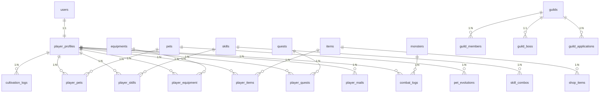

# 数据库设计文档

> 本文档覆盖数据库的完整表结构、核心字段说明和表间关系。  
> 初始化脚本：`src/main/resources/init-database.sql`

**作者**: shaun.sheng &nbsp;|&nbsp; **最后更新**: 2026-04-17

---

## 数据库基本信息

| 项 | 值 |
|----|----|
| 数据库名 | `xiuxian_game` |
| 字符集 | `utf8mb4` |
| 排序规则 | `utf8mb4_unicode_ci` |
| 引擎 | InnoDB |

---

## 表分类总览

| 分类 | 表名 | 说明 |
|------|------|------|
| **用户系统** | `users` | 账号基础信息 |
| | `player_profiles` | 玩家游戏档案 |
| **修炼系统** | `cultivation_levels` | 境界/等级配置 |
| | `cultivation_logs` | 修炼日志 |
| **技能系统** | `skills` | 技能模板 |
| | `player_skills` | 玩家技能 |
| | `skill_shop` | 技能商店 |
| | `skill_combos` | 技能连招配置 |
| | `player_skill_combo_records` | 玩家连招记录 |
| **宠物系统** | `pets` | 宠物模板 |
| | `player_pets` | 玩家宠物 |
| | `pet_skills` | 宠物技能 |
| | `pet_training_logs` | 训练日志 |
| | `pet_evolutions` | 进化配置 |
| | `player_pet_evolutions` | 玩家进化记录 |
| **装备系统** | `equipments` | 装备模板 |
| | `player_equipment` | 玩家装备 |
| **物品系统** | `items` | 物品模板 |
| | `player_items` | 玩家物品 |
| **任务系统** | `quests` | 任务模板 |
| | `player_quests` | 玩家任务 |
| | `quest_chains` | 任务链 |
| | `quest_chain_stages` | 任务链阶段 |
| **战斗系统** | `monsters` | 怪物模板 |
| | `combat_logs` | 战斗日志 |
| **商城系统** | `shop_items` | 商店物品 |
| **邮件系统** | `player_mails` | 邮件 |
| | `mail_attachments` | 邮件附件 |
| **公告系统** | `announcements` | 公告 |
| **排行榜** | `rankings` | 排行榜缓存 |
| **成就系统** | `achievements` | 成就模板 |
| | `player_achievements` | 玩家成就 |
| **宗门系统** | `guilds` | 宗门 |
| | `guild_members` | 宗门成员 |
| | `guild_applications` | 宗门申请 |
| | `guild_boss` | 宗门 BOSS 配置 |
| | `guild_boss_challenges` | BOSS 挑战记录 |
| **拍卖行** | `auction_items` | 拍卖物品 |
| **VIP 系统** | `vip_levels` | VIP 等级配置 |
| | `player_vip` | 玩家 VIP 信息 |
| | `recharge_records` | 充值记录 |
| **活动系统** | `activities` | 活动配置 |
| | `player_activity_progress` | 玩家活动进度 |
| **礼包码** | `gift_codes` | 礼包码 |
| | `gift_code_usage` | 使用记录 |
| **签到系统** | `player_check_ins` | 签到记录 |
| **叙事系统** | `npcs` | NPC 信息 |
| | `dialogue_trees` | 对话树 |
| | `dialogue_nodes` | 对话节点 |
| | `npc_daily_dialogues` | NPC 日常对话 |
| | `player_npc_relations` | 玩家NPC关系/好感度 |
| | `player_dialogue_state` | 玩家对话状态 |
| | `player_narrative_flags` | 叙事标记 |
| | `lore_entries` | 传说条目 |
| | `player_lore_collection` | 传说收集记录 |
| | `offline_narrative_events` | 离线叙事事件 |
| **地图系统** | `map_nodes` | 地图节点 |
| **日志系统** | `player_login_logs` | 登录日志 |
| | `admin_operation_logs` | 管理员操作日志 |
| | `daily_statistics` | 每日统计 |
| **配置系统** | `game_configs` | 游戏配置 |
| **离线奖励** | `offline_rewards` | 离线奖励记录 |

---

## 核心表结构

### users（用户账号表）
| 字段 | 类型 | 说明 |
|------|------|------|
| id | BIGINT PK | 用户 ID |
| username | VARCHAR(50) UNIQUE | 用户名 |
| password | VARCHAR(100) | BCrypt 加密密码 |
| email | VARCHAR(100) UNIQUE | 邮箱 |
| role | ENUM('PLAYER','ADMIN') | 角色 |
| status | TINYINT | 1:正常 0:封禁 |
| created_at | DATETIME | 注册时间 |
| last_login_at | DATETIME | 最后登录 |

---

### player_profiles（玩家档案表）
| 字段 | 类型 | 说明 |
|------|------|------|
| id | BIGINT PK | 玩家档案 ID |
| user_id | BIGINT FK→users | 关联用户 |
| nickname | VARCHAR(50) | 昵称 |
| level | INT | 等级（1-20+）|
| experience | BIGINT | 当前经验值 |
| realm | VARCHAR(20) | 修炼境界：练气期/筑基期/金丹期/元婴期 |
| realm_level | INT | 境界内等级 |
| spirit_stones | BIGINT | 灵石数量 |
| contribution_points | INT | 贡献点 |
| attribute_points | INT | 属性点 |
| skill_points | INT | 技能点 |
| attack | INT | 攻击力 |
| defense | INT | 防御力 |
| hp | INT | 当前血量 |
| max_hp | INT | 最大血量 |
| mp | INT | 当前法力 |
| max_mp | INT | 最大法力 |
| speed | INT | 速度 |
| cultivation_speed | DECIMAL(5,2) | 修炼速度倍率 |
| is_cultivating | TINYINT(1) | 是否在修炼 |
| cultivation_start_time | DATETIME | 修炼开始时间 |
| last_online_time | DATETIME | 最后在线时间 |
| combat_count | INT | 战斗次数（新手保护用）|
| breakthrough_cooldown | DATETIME | 突破冷却结束时间 |

---

### cultivation_levels（境界等级配置表）
| 字段 | 类型 | 说明 |
|------|------|------|
| id | INT PK | |
| level | INT | 总等级 |
| realm | VARCHAR(20) | 所属境界 |
| realm_level | INT | 境界内等级 |
| required_exp | BIGINT | 升至此等级所需总经验 |
| realm_bonus | DECIMAL(4,2) | 修炼灵石倍率（练气1.0/筑基1.5/金丹2.5/元婴4.0）|

**当前经验曲线：**
- 练气期 1-10 级：累计 9910 exp
- 筑基期 11-15 级：累计 58710 exp（从 0 起）
- 金丹期 16-19 级：累计 197710 exp
- 元婴期 20 级+：持续增长

---

### pets（宠物模板表）
| 字段 | 类型 | 说明 |
|------|------|------|
| id | BIGINT PK | |
| name | VARCHAR(50) | 宠物名称 |
| type | VARCHAR(20) | 类型：灵兽/妖兽/神兽 |
| rarity | VARCHAR(20) | 稀有度：COMMON/RARE/EPIC/LEGENDARY/MYTHIC |
| capture_rate | INT | 基础捕获率（0-100）|
| unlock_level | INT | 解锁所需玩家等级 |
| base_attack | INT | 基础攻击 |
| base_defense | INT | 基础防御 |
| base_hp | INT | 基础血量 |
| base_speed | INT | 基础速度 |
| growth_rate | DECIMAL(4,2) | 成长率（影响升级属性提升）|
| max_count_per_player | INT | 玩家同种宠物上限（默认3）|

---

### player_pets（玩家宠物表）
| 字段 | 类型 | 说明 |
|------|------|------|
| id | BIGINT PK | |
| player_id | BIGINT FK→player_profiles | |
| pet_id | BIGINT FK→pets | |
| nickname | VARCHAR(50) | 玩家自定义昵称 |
| level | INT | 宠物等级 |
| experience | BIGINT | 经验值 |
| loyalty | INT | 忠诚度（0-100）|
| hunger | INT | 饱食度（0-100）|
| attack | INT | 当前攻击（初始+成长）|
| defense | INT | 当前防御 |
| hp | INT | 当前血量 |
| speed | INT | 当前速度 |
| is_active | TINYINT(1) | 是否出战 |
| is_locked | TINYINT(1) | 是否锁定（防误删）|
| win_count | INT | 战斗胜利次数 |
| loss_count | INT | 战斗失败次数 |
| evolved | TINYINT(1) | 是否已进化 |

---

### npcs（NPC 表）
| 字段 | 类型 | 说明 |
|------|------|------|
| id | BIGINT PK | |
| name | VARCHAR(50) | NPC 名称 |
| title | VARCHAR(100) | 称号 |
| location | VARCHAR(50) | 所在地点 |
| description | TEXT | 背景介绍 |
| avatar_url | VARCHAR(200) | 头像 |
| default_dialogue_tree_id | VARCHAR(50) | 默认对话树 ID |
| unlock_condition | TEXT | 解锁条件（JSON格式）|

---

### dialogue_nodes（对话节点表）
| 字段 | 类型 | 说明 |
|------|------|------|
| id | BIGINT PK | |
| tree_id | VARCHAR(50) | 所属对话树 |
| node_id | VARCHAR(50) | 节点标识 |
| speaker_name | VARCHAR(50) | 说话者 |
| text | TEXT | 对话文本 |
| emotion | VARCHAR(20) | 情绪：neutral/happy/serious/sad/curious |
| choices | JSON | 选项数组 |
| next_node_id | VARCHAR(50) | 无选项时的默认下一节点 |
| flags_to_set | JSON | 触发后设置的叙事标记 |
| affinity_change | INT | 好感度变化 |
| requires_flag | VARCHAR(100) | 需要某叙事标记才显示此节点 |
| requires_affinity | INT | 需要最低好感度 |

---

## 核心数据关系

```
users (1) ←──────────── (1) player_profiles
                              │
              ┌───────────────┼─────────────────────┐
              │               │                     │
             (N)             (N)                   (N)
        player_pets    player_skills          player_equipment
              │
             (N)
        player_pet_evolutions


guild (1) ←───────────── (N) guild_members
                                  │
                                 (1) player_profiles


npcs (1) ←────────────── (N) player_npc_relations (好感度)
npcs (1) ←────────────── (N) dialogue_trees
dialogue_trees (1) ←──── (N) dialogue_nodes
```

---

## 数值公式参考

### 修炼灵石公式
```
每小时灵石 = (20 + level × 5) × cultivation_speed × realm_bonus

realm_bonus:
  练气期 = 1.0
  筑基期 = 1.5
  金丹期 = 2.5
  元婴期 = 4.0
```

### 战斗伤害公式
```
实际伤害 = max(1, 攻击方攻击 - 防御率修正)

防御率 = defense / (defense + attackerLevel × 10)
减免后伤害 = rawDamage × (1 - 防御率)

暴击：5% 概率，伤害 × 1.8
速度优势：速度 > 对方 1.5 倍时，获得额外行动机会
```

### 战斗掉落灵石公式
```
基础灵石 = 10 + 怪物等级 × 2

类型倍率：
  普通怪 × 1.0
  精英怪 × 2.5
  BOSS  × 6.0

等级差修正：
  玩家高于怪物10级：× 0.5
  玩家高于怪物5级：× 0.75
  怪物高于玩家5级：× 1.25（风险补偿）
```

---

## 索引规范

关键索引（已在 init-database.sql 中创建）：

| 表 | 字段 | 原因 |
|----|------|------|
| player_profiles | user_id | 通过用户查档案 |
| player_pets | player_id | 查玩家的宠物 |
| player_skills | player_id | 查玩家的技能 |
| player_equipment | player_id | 查玩家的装备 |
| player_mails | player_id, is_read | 查未读邮件 |
| rankings | rank_type, rank_value | 排行榜查询 |
| player_login_logs | player_id, created_at | 登录日志查询 |
| guild_members | guild_id, player_id | 宗门成员查询 |

---

## 数据库变更规范

1. 所有 DDL 变更必须更新 `init-database.sql`
2. 已有表的字段修改需要提供迁移 SQL（在 PR 描述中注明）
3. 新增表同时更新本文档的"表分类总览"
4. 不允许直接 DROP 列——改为软删除（添加 `is_deleted` 或标记字段）

---

## ER 关系图



---

## 索引优化建议

### 现有索引

| 表 | 字段 | 类型 | 原因 |
|----|------|------|------|
| player_profiles | user_id | UNIQUE | 通过用户查档案，100% 查询都带此条件 |
| player_pets | player_id | INDEX | 查玩家的宠物列表，高频查询 |
| player_skills | player_id | INDEX | 查玩家的技能列表 |
| player_equipment | player_id | INDEX | 查玩家的装备 |
| player_mails | (player_id, is_read) | COMPOSITE | 查未读邮件+分页 |
| rankings | (rank_type, rank_value) | COMPOSITE | 排行榜按类型排序 |
| player_login_logs | (player_id, created_at) | COMPOSITE | 按时间倒序查询 |
| guild_members | (guild_id, player_id) | COMPOSITE | 查宗门成员、查玩家所属宗门 |

### 建议新增索引

| 表 | 建议字段 | 类型 | 使用场景 | 优先级 |
|----|---------|------|---------|--------|
| player_profiles | realm | INDEX | 排行榜查询"某境界玩家" | 中 |
| combat_logs | (player_id, combat_type, created_at) | COMPOSITE | 查询玩家战斗历史 | 中 |
| auction_items | (status, price) | COMPOSITE | 拍卖列表排序 | 高 |
| player_quests | (player_id, status) | COMPOSITE | 查询进行中任务 | 高 |
| player_check_ins | (player_id, check_in_date) | COMPOSITE | 签到查询+去重 | 高 |
| guild_boss_challenges | (guild_id, boss_id, challenge_date) | COMPOSITE | 查询每日挑战次数 | 中 |

### 索引设计原则

1. **最左匹配原则**：复合索引的前缀列必须是查询条件中的高频字段
2. **区分度原则**：优先在区分度高的字段建索引（如 status 字段只有 0/1 不适合单独建索引）
3. **覆盖索引原则**：尽量让索引包含 SELECT 的所有字段，减少回表
4. **避免冗余索引**：已有复合索引 `(a,b)` 就不需要单独给 `a` 建索引

---

## 性能优化建议

### SQL 优化

**避免 N+1 查询**：
```sql
-- ❌ 错误示例：循环查询每个玩家
SELECT * FROM player_profiles WHERE id = ?; -- 执行 N 次

-- ✅ 正确示例：批量查询
SELECT * FROM player_profiles WHERE id IN (?, ?, ?, ...); -- 执行 1 次
```

**使用覆盖索引**：
```sql
-- ❌ 回表查询
SELECT * FROM player_profiles WHERE realm = '筑基期';

-- ✅ 覆盖索引
SELECT id FROM player_profiles WHERE realm = '筑基期'; -- realm 已有索引
```

**避免全表扫描**：
```sql
-- ❌ 对索引列使用函数
SELECT * FROM player_profiles WHERE DATE(created_at) = '2026-04-17';

-- ✅ 范围查询
SELECT * FROM player_profiles WHERE created_at >= '2026-04-17 00:00:00' 
  AND created_at <= '2026-04-17 23:59:59';
```

### 锁优化

**乐观锁**：
```java
// 使用 version 字段实现乐观锁
UPDATE player_profiles 
SET spirit_stones = spirit_stones - 100, version = version + 1 
WHERE id = ? AND version = ?
```

**行级锁**：
```sql
-- 使用 FOR UPDATE 锁定特定行（慎用）
SELECT * FROM player_items 
WHERE player_id = ? AND item_id = ? 
FOR UPDATE;
```

### 事务隔离级别

- 默认：`READ COMMITTED`（MySQL 默认级别）
- 需要幻读防护：使用可重复读`REPEATABLE READ`（MySQL 默认已支持 MVCC）
- 并发性能优先：使用`READ UNCOMMITTED`（允许脏读，仅用于统计查询）

---

## 分库分表规划

### 当前状态

**当前方案**：单库 50+ 表，MySQL 部署在 16C32G 服务器  
**数据量**：日活 1000，单表最大数据量 ~100 万行（combat_logs）  
**性能**：查询响应时间 < 50ms，写入 TPS ~200

### 未来规划（日活>5000 时考虑）

**第一阶段**：读写分离
- 主库负责写操作
- 从库负责查询（排行榜、修炼状态等）
- 延迟容忍度：1-3 秒

**第二阶段**：分库分表
- 按玩家 ID 分片：`player_id % 10`
- 分片键：player_id、user_id
- 中间件：ShardingSphere（MyCat 备选）

**第三阶段**：冷热数据分离
- 热数据：最近 30 天活跃玩家（Redis 缓存）
- 温数据：最近 90 天活跃玩家（MySQL SSD）
- 冷数据：不活跃玩家（MySQL HDD 归档）

---

## 常见问题排查

### 慢查询排查步骤

1. **启用慢查询日志**：
   ```sql
   SET GLOBAL slow_query_log = 'ON';
   SET GLOBAL long_query_time = 1; -- 超过 1 秒的查询
   SET GLOBAL log_queries_not_using_indexes = 'ON';
   ```

2. **分析慢查询**：
   ```bash
   mysqldumpslow /var/log/mysql/slow.log
   ```

3. **使用 EXPLAIN 分析**：
   ```sql
   EXPLAIN SELECT * FROM player_profiles WHERE user_id = ?;
   ```
   关注字段：
   - `type`：ALL（全表扫描）→ 需要优化
   - `key`：NULL（未用索引）→ 需要优化
   - `rows`：扫描行数，越少越好
   - `Extra`：Using filesort（文件排序）→ 需要优化

### 死锁排查

**常见死锁场景**：
1. 两个事务同时更新两行，交叉等待
2. 批量更新时顺序不一致
3. 外键约束导致的隐式锁等待

**排查方法**：
```sql
-- 查看当前锁等待
SELECT * FROM information_schema.innodb_lock_waits;

-- 查看锁信息
SELECT * FROM performance_schema.data_locks;

-- 查看事务信息
SELECT * FROM information_schema.innodb_trx;
```

---

## 表设计原则

### 命名规范

1. **表名**：小写字母 + 下划线，复数形式
   - ✅ `player_profiles`, `combat_logs`
   - ❌ `PlayerProfile`, `playerProfiles`

2. **字段名**：小写字母 + 下划线
   - ✅ `player_id`, `created_at`
   - ❌ `playerId`, `createdAt`

3. **主键**：统一使用 `id`（BIGINT AUTO_INCREMENT）

4. **外键**：`{关联表}_id`（如 `user_id`, `player_id`）

### 字段类型选择

| 场景 | 推荐类型 | 原因 |
|------|---------|------|
| 金额（精确） | DECIMAL(10,2) | 避免浮点精度问题 |
| 金额（整数） | BIGINT | 单位"分"，避免精度问题 |
| 时间 | DATETIME | 易读，时区转换简单 |
| 时间戳 | BIGINT | 计算方便，存储紧凑 |
| 状态枚举 | TINYINT | 1 字节，注释说明枚举值 |
| 大文本 | TEXT | 独立存储，避免主表膨胀 |
| JSON | JSON | MySQL 5.7+ 支持，结构化存储 |

### 软删除设计

```sql
CREATE TABLE example_table (
  id BIGINT PRIMARY KEY AUTO_INCREMENT,
  -- 其他字段...
  is_deleted TINYINT DEFAULT 0 COMMENT '0:正常 1:删除',
  deleted_at DATETIME NULL COMMENT '删除时间',
  INDEX idx_status (is_deleted, created_at) -- 软删除后也要支持查询
);
```

---

## 参考文档

- [后端架构总览](./BACKEND-ARCHITECTURE.md) - 包结构、分层设计
- [性能优化指南](../standards/PERFORMANCE-GUIDE.md) - 索引优化、N+1 查询优化
- [API 总览](../api/API-OVERVIEW.md) - 接口规范
- [游戏设计文档](../design/GDD-修仙挂机游戏设计文档.md) - 数值公式、系统机制

*文档最后更新：2026-04-17*
