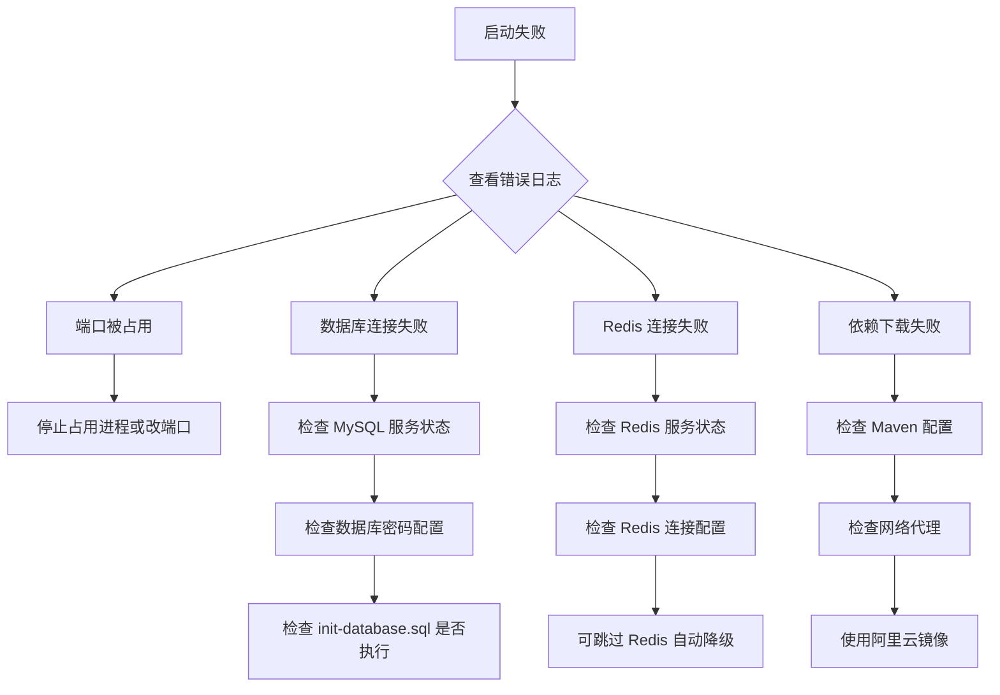
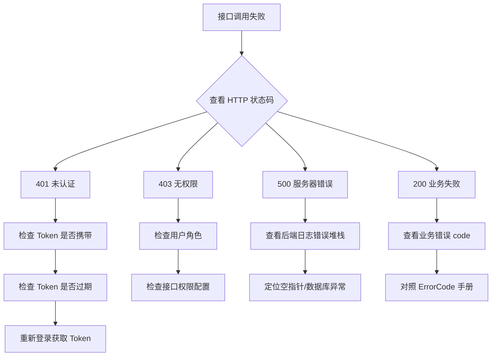

# 快速上手指南

> 完成本指南后，你将拥有一个在本地完整运行的修仙挂机游戏实例，包括游戏前端和管理后台。  
> **预计时间**：30 分钟（网络良好情况下）

**作者**: shaun.sheng &nbsp;|&nbsp; **最后更新**: 2026-04-17（文档内容质量优化）

---

## 前置条件

在开始前，确认你已安装以下工具：

| 工具 | 版本要求 | 检查命令 |
|------|---------|----------|
| Java JDK | 1.8+ | `java -version` |
| Maven | 3.6+ | `mvn -v` |
| MySQL | 8.0+ | `mysql --version` |
| Redis | 6.0+ | `redis-cli --version` |
| Git | 任意版本 | `git --version` |

> **可选**：Docker + Docker Compose（用于一键启动，跳过数据库和 Redis 安装步骤）

---

## 步骤 1：克隆项目

```bash
git clone https://github.com/SSJLYY/xiuxian.git
cd xiuxian
```

---

## 步骤 2：初始化数据库

### 方式 A：本地 MySQL（推荐开发用）

```bash
# 登录 MySQL
mysql -u root -p

# 在 MySQL 命令行中执行
CREATE DATABASE xiuxian_game CHARACTER SET utf8mb4 COLLATE utf8mb4_unicode_ci;
EXIT;

# 导入初始化脚本
mysql -u root -p xiuxian_game < src/main/resources/init-database.sql
```

验证导入成功：
```bash
mysql -u root -p -e "USE xiuxian_game; SELECT COUNT(*) AS tables FROM information_schema.tables WHERE table_schema='xiuxian_game';"
# 应该返回 50+ 张表
```

### 方式 B：Docker 一键启动（无需安装 MySQL）

```bash
docker-compose up -d mysql
# 等待约 30 秒数据库就绪
```

---

## 步骤 3：启动 Redis

项目引入了 Redis 作为主缓存层，**启动应用前必须先保证 Redis 可访问**。

### 方式 A：本地安装

```bash
# macOS
brew install redis
brew services start redis

# Ubuntu / Debian
sudo apt-get install redis-server
sudo systemctl start redis

# 验证
redis-cli ping   # 返回 PONG 即成功
```

### 方式 B：Docker（推荐，零安装）

```bash
docker run -d --name redis -p 6379:6379 redis:7-alpine
```

### 方式 C：Docker Compose（项目内置）

```bash
docker-compose up -d redis
```

> **无需密码**：默认配置 `spring.redis.password=` 为空，本地开发直接启动即可。  
> **Redis 不可用时**：应用不会崩溃，会自动降级到进程内本地缓存，但多实例部署下数据不共享，详见 [缓存架构](../architecture/CACHE-ARCHITECTURE.md)。

---

## 步骤 4：配置应用

编辑 `src/main/resources/application.properties`，修改数据库和 Redis 连接信息：

```properties
# 数据库连接
spring.datasource.url=jdbc:mysql://localhost:3306/xiuxian_game?useUnicode=true&characterEncoding=utf8&useSSL=false&serverTimezone=Asia/Shanghai
spring.datasource.username=root
spring.datasource.password=你的数据库密码

# Redis 连接（本地默认无需修改）
spring.redis.host=127.0.0.1
spring.redis.port=6379
spring.redis.password=         # 本地无密码留空

# 服务端口（默认 8082）
server.port=8082
```

> **注意**：不要提交含真实密码的配置文件。生产环境使用环境变量覆盖。

---

## 步骤 5：构建并启动

```bash
# 编译（跳过测试加速构建）
mvn clean package -DskipTests

# 启动应用
java -jar target/xiuxian-game*.jar
```

或者使用快捷脚本：
```bash
# Windows
start.bat

# Linux/macOS
./start.sh
```

看到如下日志说明启动成功：
```
Started XiuxianGameApplication in X.XXX seconds
```

---

## 步骤 6：访问游戏

| 页面 | 地址 | 账号 |
|------|------|------|
| 玩家游戏登录 | http://localhost:8082/login.html | 可在页面注册 |
| 管理员后台 | http://localhost:8082/adminLogin.html | admin / admin123 |
| 游戏主界面 | http://localhost:8082/game.html | 登录后自动跳转 |

> ⚠️ **生产环境必须修改默认管理员密码！**

---

## 常见问题

### Redis 连接失败
```
# 错误信息：Unable to connect to Redis
```
**原因**：Redis 服务未启动。

**解决**：
1. 确认 Redis 正在运行：`redis-cli ping`（应返回 PONG）
2. 如果不想安装 Redis，可以用 Docker：`docker run -d --name redis -p 6379:6379 redis:7-alpine`
3. 应用仍可启动但会降级到本地缓存，适合临时开发调试

---

### 数据库连接失败
```
# 错误信息：Communications link failure
```
**原因**：数据库未启动或连接参数错误。

**解决**：
1. 确认 MySQL 正在运行：`systemctl status mysql`（Linux）或检查服务管理器（Windows）
2. 用 `mysql -u root -p` 手动连接，确认密码正确
3. 确认数据库名称为 `xiuxian_game`

---

### 端口被占用
```
# 错误信息：Address already in use: 8082
```
**解决**：
```bash
# Windows
netstat -ano | findstr :8082
taskkill /PID <PID> /F

# Linux
lsof -i :8082 | awk 'NR>1{print $2}' | xargs kill -9
```

或修改 `application.properties` 中的 `server.port` 为其他端口。

---

### 前端页面样式错乱
**解决**：强制刷新浏览器缓存（`Ctrl+Shift+R` 或 `Cmd+Shift+R`）

---

### 登录后频繁跳回登录页
**原因**：JWT Token 过期时间配置问题或系统时间不同步。

**解决**：
```properties
# application.properties
jwt.expiration=86400000   # 24小时（毫秒）
```

---

## 代码审查机制

本项目采用严格的代码审查机制保证代码质量：

### 必读文档
- **[代码审查标准](../standards/CODE-REVIEW-STANDARDS.md)** — 审查检查清单和优先级定义
- **[代码审查流程](../standards/CODE-REVIEW-PROCESS.md)** — PR流程和角色职责
- **[代码审查模板](../standards/CODE-REVIEW-TEMPLATES.md)** — 标准化审查评论模板

### 提交PR前自查
```bash
# 1. 本地测试通过
mvn test

# 2. 对照审查清单检查
# 见 CODE-REVIEW-STANDARDS.md 第2节

# 3. 确保无Blocker级别问题
```

### 审查优先级
| 级别 | 说明 | 处理方式 |
|------|------|----------|
| 🔴 Blocker | 安全漏洞、数据风险、并发问题 | 必须修复 |
| 🟡 Major | 性能问题、测试缺失、命名混乱 | 应该修复 |
| 💭 Minor | 风格建议、文档缺失 | 可选修复 |

---

## 下一步

- [后端架构总览](../architecture/BACKEND-ARCHITECTURE.md) — 了解项目的技术设计
- [缓存架构](../architecture/CACHE-ARCHITECTURE.md) — Redis 双层缓存与降级策略
- [后端编码规范](../standards/BACKEND-CODING-STANDARDS.md) — 开始写代码前必读
- **[代码审查标准](../standards/CODE-REVIEW-STANDARDS.md)** — 提交PR前必读
- [API 总览](../api/API-OVERVIEW.md) — 接口文档入口
- [API 总览](../api/API-OVERVIEW.md) — 接口文档入口

---

## 附录 A：开发环境配置建议

### 推荐 IDE 配置

**IntelliJ IDEA**：
```
1. File → Settings → Build, Execution, Deployment → Compiler
   - Override compiler parameters per-user: -Xmx2048m
   
2. File → Settings → Editor → Code Style → Java
   - 导入项目的 code style 配置（项目根目录 .idea/codeStyles/）
   
3. File → Settings → Plugins
   - 安装推荐插件：
     • Lombok（必装）
     • MyBatisX（数据库开发）
     • Rainbow Brackets（括号高亮）
     • String Manipulation（字符串工具）
```

**VS Code**（前端开发）：
```
推荐扩展：
- Live Server（本地 Web 服务器）
- Prettier（代码格式化）
- ES7+ React/Redux/React-Native snippets
```

### Maven 配置优化

**国内镜像**（加速依赖下载）：
```xml
<!-- ~/.m2/settings.xml -->
<mirrors>
  <mirror>
    <id>aliyun-maven</id>
    <mirrorOf>central</mirrorOf>
    <name>阿里云公共仓库</name>
    <url>https://maven.aliyun.com/repository/public</url>
  </mirror>
</mirrors>
```

**Maven 多版本管理**：
```bash
# macOS (使用 asdf)
asdf install java 8.0.322
asdf local java 8.0.322

# Windows (使用 jEnv)
jenv install 1.8.0_322
jenv local 1.8.0_322
```

---

## 附录 B：常用命令速查

### 开发常用命令

```bash
# 1. 编译 + 跳过测试
mvn clean package -DskipTests

# 2. 运行单测
mvn test -Dtest=PlayerServiceTest

# 3. 运行单个 Controller
java -jar target/xiuxian-game*.jar

# 4. 查看日志
tail -f logs/xiuxian-game.log

# 5. 查看端口占用
netstat -tlnp | grep 8082    # Linux/Mac
netstat -ano | findstr 8082  # Windows
```

### 数据库常用命令

```bash
# 1. 备份数据库
mysqldump -u root -p xiuxian_game > backup.sql

# 2. 恢复数据库
mysql -u root -p xiuxian_game < backup.sql

# 3. 导出表结构
mysqldump -u root -p --no-data xiuxian_game > schema.sql

# 4. 导出测试数据
mysqldump -u root -p --no-create-info xiuxian_game > data.sql
```

### Docker 常用命令

```bash
# 1. 启动所有服务
docker-compose up -d

# 2. 查看日志
docker-compose logs -f

# 3. 重启单个服务
docker-compose restart mysql

# 4. 停止所有服务
docker-compose down

# 5. 清理数据卷
docker-compose down -v
```

---

## 附录 C：技术栈依赖版本对应关系

| 依赖 | 版本 | 依赖关系 |
|------|------|---------|
| Java | 1.8 | 最低要求 |
| Spring Boot | 2.7.18 | 内嵌 Tomcat 9.0.x |
| Spring Security | 5.7.x | 与 Spring Boot 配套 |
| MyBatis-Plus | 3.5.3.1 | 支持 Spring Boot 2.7.x |
| MySQL Driver | 8.0.x | 与 MySQL 8.0 兼容 |
| Redis (Lettuce) | 6.0+ | Spring Boot 内嵌 |
| Jackson | 2.13.x | Spring Boot 内嵌 |
| Lombok | 1.18.x | 编译时注解处理 |

**Java 8 兼容性说明**：
- 项目使用 `Java8Compatibility` 工具类模拟 Java 9+ 方法
- `Java8Compatibility.mapOf()` 替代 `Map.of()`
- `Java8Compatibility.listOf()` 替代 `List.of()`
- `Java8Compatibility.isEmpty()` 替代 `List.isEmpty()`

---

## 附录 D：常见问题排查流程图

### 启动失败排查流程



### 接口调用失败排查流程



---

## 附录 E：学习资源推荐

### 技术栈入门

**Spring Boot**：
- [Spring Boot 官方文档](https://spring.io/projects/spring-boot)
- [Spring Boot 实战（书籍）](https://item.jd.com/12736798.html)
- [Spring Boot 教程（廖雪峰）](https://www.liaoxuefeng.com/wiki/1270186841660032)

**MyBatis-Plus**：
- [MyBatis-Plus 官方文档](https://baomidou.com/)
- [MyBatis-Plus 代码生成器](https://baomidou.com/pages/223848/)

**Redis**：
- [Redis 官方文档](https://redis.io/documentation)
- [Redis 设计与实现（书籍）](https://redisbook.com/)

### 架构设计

**DDD（领域驱动设计）**：
- [领域驱动设计术语](https://dddcrew.com/glossary/)（当前项目 v2 阶段）

**微服务架构**：
- [Spring Cloud 官方文档](https://spring.io/projects/spring-cloud)（当前项目 v3 阶段）

### 游戏开发

**游戏架构**：
- [游戏编程架构（书籍）](https://book.douban.com/subject/30345537/)
- [游戏服务器端设计与实现](https://github.com/liuianxin/awesome-game-development)

**数值策划**：
- [游戏数值策划文档](./design/GDD-修仙挂机游戏设计文档.md)（项目内部文档）

---

**文档维护说明**：
- 本指南随项目更新而更新，如发现文档与代码不一致请提 Issue
- 示例命令适用于 Linux/macOS，Windows 用户使用 PowerShell 命令
- 推荐优先使用 Docker Compose 方式，避免环境配置问题

*文档最后更新：2026-04-17*
