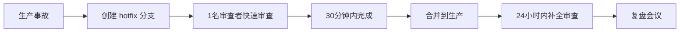

# 代码审查机制优化方案

> 基于现有审查机制的全面评估和改进建议

**作者**: 代码审查专家 (shaun.sheng)  
**创建日期**: 2026-03-26  
**状态**: 待评审

---

## 📊 执行摘要

### 现状评估

项目已建立较为完善的代码审查框架,包括:
- ✅ **完整的文档体系**: CODE-REVIEW-STANDARDS.md、CODE-REVIEW-PROCESS.md、CODE-REVIEW-TEMPLATES.md
- ✅ **明确的优先级定义**: Blocker/Major/Minor 三级分类
- ✅ **规范的审查流程**: PR提交 → 代码审查 → 合并发布
- ✅ **编码规范配套**: BACKEND-CODING-STANDARDS.md 与审查清单联动

### 存在问题

通过分析现有代码( AntiFraudService.java、AsyncStatisticsService.java、NarrativeService.java),发现以下关键问题:

| 问题类型 | 严重程度 | 影响范围 | 说明 |
|---------|---------|---------|------|
| **执行落地不足** | 🔴 高 | 全局 | 有文档但未强制执行,代码质量参差不齐 |
| **缺少自动化检查** | 🔴 高 | 全局 | 无CI集成、无静态代码分析、无单元测试覆盖率检查 |
| **审查资源不足** | 🟡 中 | 全局 | 缺少审查者培训和认证机制 |
| **缺少度量指标** | 🟡 中 | 全局 | 无量化数据追踪审查质量和效率 |
| **模块边界违规** | 🔴 高 | 架构层面 | 历史遗留问题,需系统性清理 |

---

## 🎯 改进目标

### 短期目标 (1-2个月)
1. **建立CI/CD审查自动化**: 集成Checkstyle、SpotBugs、单元测试覆盖率检查
2. **强制执行编码规范**: 代码不通过检查不得合并
3. **完善模块边界扫描**: 自动化检测跨模块Mapper调用
4. **培训首批审查者**: 3-5名核心开发者通过审查者认证

### 中期目标 (3-6个月)
1. **建立度量体系**: 审查响应时间、缺陷逃逸率、代码质量趋势
2. **优化审查流程**: 分级审查机制、紧急修复快速通道
3. **持续重构**: 清理历史代码中的模块边界违规
4. **知识沉淀**: 建立优秀PR案例库和常见问题手册

### 长期目标 (6-12个月)
1. **文化建立**: 全员参与审查,质量意识深入人心
2. **工具链完善**: 自动代码审查(AI辅助)、智能问题发现
3. **持续改进**: 基于数据的流程优化和规范迭代

---

## 🔍 当前代码问题分析

### 案例1: AntiFraudService.java

**发现的问题**:

```java
// ✅ 做得好的地方
- 使用 PlayerService 接口而非直接访问 Mapper (符合模块边界规范)
- 使用 ThreadLocalRandom (符合并发安全规范)
- 异常处理完善,使用 LogUtils 记录
- 并发安全: 使用 ConcurrentHashMap 存储计数器

// ❌ 问题点
🟡 Major: 缺少输入验证
private boolean isAbnormalResourceIncrease(String resourceType, long increase) {
    // resourceType 可能传入 null 或非法值,会导致 NullPointerException
    Map<String, Long> thresholds = new HashMap<>();
    // 每次调用都创建新的 Map,性能可优化
}

🟡 Major: 硬编码阈值
thresholds.put("SPIRIT_STONES", 100000L); // 应该提取为配置常量
thresholds.put("EXP", 50000L);
thresholds.put("YUANBAO", 10000L);

💭 Minor: 内部类可以提取为独立类
private static class AbnormalBehaviorCounter {
    // 复杂度较高,建议提取为独立类以提高可测试性
}
```

**审查建议**:
```markdown
🟡 **Major: 缺少输入验证**

`isAbnormalResourceIncrease()` 方法缺少参数校验,可能导致 NPE。

**影响:**
如果 resourceType 传入 null,thresholds.get() 会返回 null,后续比较会抛异常。

**建议:**
```java
private boolean isAbnormalResourceIncrease(String resourceType, long increase) {
    if (resourceType == null || resourceType.trim().isEmpty()) {
        log.warn("资源类型为空,跳过检测");
        return false;
    }
    
    Map<String, Long> thresholds = getResourceThresholds(); // 提取为方法
    Long threshold = thresholds.get(resourceType);
    return threshold != null && increase > threshold;
}

private static final Map<String, Long> RESOURCE_THRESHOLDS = Map.of(
    "SPIRIT_STONES", 100000L,
    "EXP", 50000L,
    "YUANBAO", 10000L
);

private Map<String, Long> getResourceThresholds() {
    return RESOURCE_THRESHOLDS;
}
```

**优先级:** 中(建议在下个版本修复)
```

---

### 案例2: AsyncStatisticsService.java

**发现的问题**:

```java
// ✅ 做得好的地方
- 使用 RechargeService 接口(符合模块边界规范)
- 使用 CompletableFuture 实现异步
- 定时任务使用 @Scheduled 注解

// ❌ 问题点
🟡 Major: BigDecimal 精度问题
BigDecimal.valueOf(rechargeStats.getTotalAmount())
    .divide(BigDecimal.valueOf(activePlayers), 2, BigDecimal.ROUND_HALF_UP);
// ROUND_HALF_UP 已过时,应使用 RoundingMode.HALF_UP

🟡 Major: 重复代码
private int countNewPlayers(LocalDate date) { ... }
private int countActivePlayers(LocalDate date) { ... }
// 逻辑相似,可提取为通用方法

🟡 Major: 缺少幂等性保护
if (existingStats != null) {
    log.info("统计数据已存在,跳过聚合");
    return;
}
// 存在并发问题,可能重复插入
```

**审查建议**:
```markdown
🟡 **Major: BigDecimal 精度问题**

使用已过时的 ROUND_HALF_UP 常量。

**当前代码:**
```java
BigDecimal arpu = BigDecimal.valueOf(rechargeStats.getTotalAmount())
    .divide(BigDecimal.valueOf(activePlayers), 2, BigDecimal.ROUND_HALF_UP);
```

**建议修复:**
```java
BigDecimal arpu = BigDecimal.valueOf(rechargeStats.getTotalAmount())
    .divide(BigDecimal.valueOf(activePlayers), 2, RoundingMode.HALF_UP);
```

**原因:**
`BigDecimal.ROUND_HALF_UP` 在 Java 9+ 已标记为 deprecated,应使用 `RoundingMode` 枚举。

**优先级:** 高(影响代码可维护性和未来兼容性)

---

🟡 **Major: 缺少幂等性保护**

统计聚合任务存在并发安全问题,可能导致重复插入。

**当前代码:**
```java
QueryWrapper<DailyStatistics> existsWrapper = new QueryWrapper<>();
existsWrapper.eq("stat_date", yesterday);
DailyStatistics existingStats = dailyStatisticsMapper.selectOne(existsWrapper);

if (existingStats != null) {
    log.info("统计数据已存在,跳过聚合");
    return;
}
// ... 后续插入逻辑
```

**建议修复:**
```java
// 方案1: 使用唯一索引 + 异常处理
@Transactional
public void aggregateDailyStatistics() {
    try {
        DailyStatistics stats = buildDailyStatistics(yesterday);
        dailyStatisticsMapper.insert(stats);
    } catch (DuplicateKeyException e) {
        log.info("统计数据已存在,跳过聚合: date={}", yesterday);
    }
}

// 方案2: 使用分布式锁
@Scheduled(cron = "0 0 1 * * ?")
public void aggregateDailyStatistics() {
    String lockKey = "statistics:aggregate:" + yesterday;
    if (redisLock.tryLock(lockKey, 30, TimeUnit.SECONDS)) {
        try {
            // 原有逻辑
        } finally {
            redisLock.unlock(lockKey);
        }
    } else {
        log.info("其他实例正在聚合统计数据: date={}", yesterday);
    }
}
```

**优先级:** 高(生产环境可能出现数据重复)
```

---

### 案例3: NarrativeService.java

**发现的问题**:

```java
// ✅ 做得好的地方
- 模块内 Mapper 使用合规(narrative module → narrative mappers)
- 使用 ThreadLocalRandom (符合并发安全规范)
- 事务边界合理,只在必要时使用 @Transactional

// ❌ 问题点
🔴 Blocker: 乱码问题
String error = "对话节点缺失: " + nodeKey;  // 第208行
// 文件中存在大量乱码注释,如: "澶勭悊瀵硅瘽鏍戝畬鎴愭晥鏋?"、"鏇存柊NPC浜掑姩"

🟡 Major: 方法过长
public DialogueSceneData startOrContinueDialogue(Integer playerId, String dialogueKey)
// 50+ 行,职责过多,建议拆分

🟡 Major: 重复查询
Npc npc = npcMapper.selectById(tree.getNpcId());  // 多次调用 getNpcName()
// 应该在方法开始时一次性加载并缓存

🟡 Major: 异常处理过于宽泛
} catch (Exception e) {
    log.warn("解析required_flags失败: {}", tree.getRequiredFlags(), e);
}
// 应该捕获具体异常类型
```

**审查建议**:
```markdown
🔴 **Blocker: 文件乱码**

NarrativeService.java 文件中存在大量乱码注释和字符串,影响代码可读性和可维护性。

**受影响的行:**
- Line 176: "澶勭悊瀵硅瘽鏍戝畬鎴愭晥鏋?"
- Line 185: "鏇存柊NPC浜掑姩"
- Line 195: "鏇存柊褰撳墠鑺傜偣"
- Line 208: "瀵硅瘽鑺傜偣涓㈠け"
- Line 218: "褰撳墠鑺傜偣"
- Line 226: "濡傛灉鏄痗hoice鑺傜偣锛岃幏鍙栭€夐」"
- Line 238: "鐢鐢╪odeKey浣滀负tag"
- Line 249: "澶勭悊鑺傜偣鏁堟灉锛坒lag璁剧疆/娓呴櫎銆佸ソ鎰熷害鍙樻洿锛?"

**建议修复:**
1. 确认文件编码为 UTF-8 无 BOM
2. 重新编码文件,将乱码部分修复为中文:
   - "处理对话树完成效果"
   - "更新NPC互动"
   - "更新当前节点"
   - "对话节点缺失"
   - "当前节点"
   - "如果是choice节点,获取选项"
   - "用nodeKey作为tag"
   - "处理节点效果(flag设置/清除、好感度变更)"

**紧急程度:** 🔴 必须立即修复,否则影响代码审查

**参考:** 项目编码规范 [BACKEND-CODING-STANDARDS.md#编码规范](./BACKEND-CODING-STANDARDS.md)

---

🟡 **Major: 方法过长,职责过多**

`startOrContinueDialogue()` 方法包含50+行逻辑,职责过重。

**当前结构:**
1. 检查对话树是否存在
2. 检查前置条件
3. 获取/创建对话状态
4. 获取起始节点
5. 构建场景数据

**建议拆分:**
```java
@Transactional
public DialogueSceneData startOrContinueDialogue(Integer playerId, String dialogueKey) {
    DialogueTree tree = validateDialogueTree(dialogueKey);
    checkPrerequisites(tree, playerId);
    
    PlayerDialogueState state = getOrCreateDialogueState(tree, playerId);
    String nodeKey = resolveStartingNode(state, tree);
    
    return buildSceneData(tree, nodeKey, playerId);
}

private DialogueTree validateDialogueTree(String dialogueKey) {
    DialogueTree tree = dialogueTreeMapper.selectActiveByKey(dialogueKey);
    if (tree == null) {
        throw new BusinessException(ErrorCode.NOT_FOUND, "对话不存在");
    }
    return tree;
}

private void checkPrerequisites(DialogueTree tree, Integer playerId) {
    Set<String> playerFlags = getPlayerFlags(playerId);
    if (!meetsPrerequisites(tree, playerId, playerFlags)) {
        throw new BusinessException(ErrorCode.FORBIDDEN, "不满足对话前置条件");
    }
}

private PlayerDialogueState getOrCreateDialogueState(DialogueTree tree, Integer playerId) {
    PlayerDialogueState state = playerDialogueStateMapper.selectByPlayerAndTree(playerId, tree.getId());
    
    if (state == null) {
        return createNewDialogueState(tree, playerId);
    } else if (!state.getIsCompleted()) {
        return state;
    } else {
        return resetRepeatableDialogue(state, tree);
    }
}

private String resolveStartingNode(PlayerDialogueState state, DialogueTree tree) {
    String nodeKey = state.getCurrentNodeKey();
    if (nodeKey == null) {
        List<DialogueNode> roots = dialogueNodeMapper.selectRootNodes(tree.getId());
        if (roots.isEmpty()) {
            throw new BusinessException(ErrorCode.SYSTEM_ERROR, "对话树没有起始节点");
        }
        return roots.get(0).getNodeKey();
    }
    return nodeKey;
}
```

**优先级:** 中(建议重构,提高可读性和可测试性)
```

---

## 🚀 实施方案

### 阶段一: 自动化审查基础设施 (Week 1-2)

#### 1.1 集成 Maven 代码质量检查

**添加 Checkstyle 插件** (pom.xml):

```xml
<plugin>
    <groupId>org.apache.maven.plugins</groupId>
    <artifactId>maven-checkstyle-plugin</artifactId>
    <version>3.3.0</version>
    <configuration>
        <configLocation>checkstyle.xml</configLocation>
        <consoleOutput>true</consoleOutput>
        <failsOnError>true</consoleOutput>
        <includeTestSourceDirectory>false</includeOutput>
    </configuration>
    <executions>
        <execution>
            <id>validate</id>
            <phase>validate</phase>
            <goals>
                <goal>check</goal>
            </goals>
        </execution>
    </executions>
</plugin>
```

**创建 checkstyle.xml** (src/main/resources):

```xml
<?xml version="1.0"?>
<!DOCTYPE module PUBLIC
    "-//Checkstyle//DTD Checkstyle Configuration 1.3//EN"
    "https://checkstyle.org/dtds/configuration_1_3.dtd">
    
<module name="Checker">
    <property name="charset" value="UTF-8"/>
    <property name="severity" value="warning"/>
    
    <!-- 检查文件长度 -->
    <module name="FileLength">
        <property name="max" value="1500"/>
    </module>
    
    <!-- 检查行长度 -->
    <module name="LineLength">
        <property name="max" value="120"/>
    </module>
    
    <!-- 导入检查 -->
    <module name="TreeWalker">
        <module name="ImportOrder">
            <property name="groups" value="java,javax,org,com"/>
            <property name="ordered" value="true"/>
            <property name="separated" value="true"/>
            <property name="option" value="top"/>
        </module>
        
        <module name="AvoidStarImport"/>
        <module name="UnusedImports"/>
        <module name="RedundantImport"/>
        
        <!-- 命名规范 -->
        <module name="ConstantName"/>
        <module name="LocalFinalVariableName"/>
        <module name="LocalVariableName"/>
        <module name="MemberName"/>
        <module name="MethodName"/>
        <module name="PackageName"/>
        <module name="ParameterName"/>
        <module name="StaticVariableName"/>
        <module name="TypeName"/>
        
        <!-- 编码规范 -->
        <module name="LeftCurly"/>
        <module name="RightCurly"/>
        <module name="NeedBraces"/>
        <module name="WhitespaceAround"/>
        <module name="EmptyBlock"/>
        <module name="EmptyStatement"/>
        
        <!-- 复杂度检查 -->
        <module name="CyclomaticComplexity">
            <property name="max" value="10"/>
        </module>
        <module name="MethodLength">
            <property name="max" value="50"/>
        </module>
        <module name="ParameterNumber">
            <property name="max" value="5"/>
        </module>
    </module>
</module>
```

#### 1.2 集成 SpotBugs 静态分析

**添加 SpotBugs 插件** (pom.xml):

```xml
<plugin>
    <groupId>com.github.spotbugs</groupId>
    <artifactId>spotbugs-maven-plugin</artifactId>
    <version>4.7.3.6</version>
    <configuration>
        <effort>Max</effort>
        <threshold>Low</threshold>
        <failOnError>true</failOnError>
        <xmlOutput>true</xmlOutput>
    </configuration>
    <executions>
        <execution>
            <id>spotbugs-check</id>
            <phase>verify</phase>
            <goals>
                <goal>check</goal>
            </goals>
        </execution>
    </executions>
</plugin>
```

#### 1.3 集成 JaCoCo 单元测试覆盖率

**添加 JaCoCo 插件** (pom.xml):

```xml
<plugin>
    <groupId>org.jacoco</groupId>
    <artifactId>jacoco-maven-plugin</artifactId>
    <version>0.8.10</version>
    <configuration>
        <rules>
            <rule>
                <element>PACKAGE</element>
                <limits>
                    <limit>
                        <counter>LINE</counter>
                        <value>COVEREDRATIO</value>
                        <minimum>0.60</minimum>
                    </limit>
                    <limit>
                        <counter>BRANCH</counter>
                        <value>COVEREDRATIO</value>
                        <minimum>0.50</minimum>
                    </limit>
                </limits>
            </rule>
        </rules>
    </configuration>
    <executions>
        <execution>
            <id>prepare-agent</id>
            <goals>
                <goal>prepare-agent</goal>
            </goals>
        </execution>
        <execution>
            <id>report</id>
            <phase>test</phase>
            <goals>
                <goal>report</goal>
            </goals>
        </execution>
        <execution>
            <id>check</id>
            <goals>
                <goal>check</goal>
            </goals>
        </execution>
    </executions>
</plugin>
```

#### 1.4 创建 CI/CD 配置

**GitHub Actions 工作流** (.github/workflows/code-review.yml):

```yaml
name: 代码审查自动化

on:
  pull_request:
    branches: [ main, develop ]

jobs:
  code-quality:
    runs-on: ubuntu-latest
    
    steps:
    - name: 检出代码
      uses: actions/checkout@v3
      with:
        fetch-depth: 0
    
    - name: 设置 JDK 8
      uses: actions/setup-java@v3
      with:
        java-version: '8'
        distribution: 'temurin'
    
    - name: 编译项目
      run: mvn clean compile
    
    - name: 运行单元测试
      run: mvn test
    
    - name: 检查代码覆盖率
      run: mvn jacoco:check
    
    - name: 运行 Checkstyle
      run: mvn checkstyle:check
    
    - name: 运行 SpotBugs
      run: mvn spotbugs:check
    
    - name: 扫描模块边界违规
      run: ./scripts/scan_modules.ps1
    
    - name: 生成审查报告
      run: |
        echo "## 代码质量报告" > $GITHUB_STEP_SUMMARY
        echo "### 测试覆盖率" >> $GITHUB_STEP_SUMMARY
        cat target/site/jacoco/index.html | grep -A 5 "Total" >> $GITHUB_STEP_SUMMARY || true
        echo "### 静态分析" >> $GITHUB_STEP_SUMMARY
        mvn spotbugs:check || echo "发现潜在bug,请查看详细报告"
    
    - name: 上传测试覆盖率报告
      uses: actions/upload-artifact@v3
      with:
        name: jacoco-report
        path: target/site/jacoco/
    
    - name: 上传 SpotBugs 报告
      uses: actions/upload-artifact@v3
      with:
        name: spotbugs-report
        path: target/spotbugs/
```

---

### 阶段二: 强制编码规范执行 (Week 3-4)

#### 2.1 修复现有代码问题

**优先级排序**:

| 优先级 | 文件 | 问题 | 工作量 | 负责人 |
|-------|------|------|-------|--------|
| P0 | NarrativeService.java | 乱码修复 | 2h | @待分配 |
| P0 | AsyncStatisticsService.java | BigDecimal精度 | 1h | @待分配 |
| P1 | AntiFraudService.java | 输入验证 | 2h | @待分配 |
| P1 | AsyncStatisticsService.java | 幂等性保护 | 4h | @待分配 |
| P2 | NarrativeService.java | 方法拆分 | 4h | @待分配 |

#### 2.2 建立预提交钩子

**创建 .pre-commit-config.yaml**:

```yaml
repos:
  - repo: https://github.com/psf/black
    rev: 23.3.0
    hooks:
      - id: black
        language_version: python3.9
  
  - repo: https://github.com/pre-commit/mirrors-mypy
    rev: v1.3.0
    hooks:
      - id: mypy
        additional_dependencies: [types-all]
  
  - repo: local
    hooks:
      - id: checkstyle
        name: Checkstyle
        entry: mvn checkstyle:check
        language: system
        pass_filenames: false
        always_run: true
      
      - id: unit-tests
        name: 运行单元测试
        entry: mvn test
        language: system
        pass_filenames: false
```

**安装预提交钩子**:

```bash
pip install pre-commit
pre-commit install
```

#### 2.3 IDE 配置标准化

**创建 IntelliJ IDEA 配置** (.idea/codeStyles/Project.xml):

```xml
<component name="ProjectCodeStyleConfiguration">
  <code_scheme name="Project" version="173">
    <option name="RIGHT_MARGIN" value="120"/>
    <option name="WRAP_WHEN_TYPING_REACHES_RIGHT_MARGIN" value="true"/>
    <JavaCodeStyleSettings>
      <option name="IMPORT_LAYOUT_TABLE">
        <value>
          <package name="java" withSubpackages="true" static="false"/>
          <package name="javax" withSubpackages="true" static="false"/>
          <emptyLine line="true"/>
          <package name="org" withSubpackages="true" static="false"/>
          <package name="com" withSubpackages="true" static="false"/>
        </value>
      </option>
    </JavaCodeStyleSettings>
  </code_scheme>
</component>
```

---

### 阶段三: 审查流程优化 (Month 2)

#### 3.1 建立审查者培训体系

**审查者认证流程**:

1. **理论学习** (2天)
   - 阅读所有审查标准文档
   - 完成编码规范在线测试 (≥80分)

2. **实践考核** (3天)
   - 完成10个模拟PR审查
   - 至少3个资深审查者认可

3. **导师带教** (1周)
   - 在导师指导下参与真实PR审查
   - 通过3个真实PR审查

4. **独立认证** (1周)
   - 独立完成5个PR审查
   - 通过质量评分 (≥7/10分)

**审查者分级制度**:

| 级别 | 要求 | 权限 |
|------|------|------|
| **初级审查者** | 通过基础认证 | 可审查非核心模块 |
| **中级审查者** | 完成20个PR审查 | 可审查核心模块 |
| **高级审查者** | 完成50个PR审查 + 1年经验 | 可审查架构变更 |
| **首席审查者** | 3年经验 + 贡献规范 | 最终审批权 |

#### 3.2 优化 PR 模板

**更新 .github/PULL_REQUEST_TEMPLATE.md**:

```markdown
## PR 描述

### 变更类型
- [ ] Bug修复
- [ ] 新功能
- [ ] 代码重构
- [ ] 性能优化
- [ ] 文档更新
- [ ] 测试补充

### 变更说明
[简要描述本次变更的目的和范围]

### 关联 Issue
Closes #<issue_number>

### 影响范围
- [ ] 数据库变更
- [ ] API 接口变更
- [ ] 配置文件变更
- [ ] 前端页面变更

---

## 代码质量自查

### 自动化检查
- [ ] `mvn clean compile` 通过
- [ ] `mvn test` 通过 (覆盖率 ≥60%)
- [ ] `mvn checkstyle:check` 通过
- [ ] `mvn spotbugs:check` 通过
- [ ] 模块边界检查通过 (无跨模块Mapper调用)

### 编码规范
- [ ] 异常处理符合规范 (使用 BusinessException + ErrorCode)
- [ ] 随机数使用 ThreadLocalRandom
- [ ] 密码验证使用 passwordEncoder.matches()
- [ ] 事务边界合理 (只在原子写操作加 @Transactional)
- [ ] 日志使用规范 (循环内无info, error带异常对象)
- [ ] 无业务逻辑在 Controller 中
- [ ] 新增 ErrorCode 已在代码和文档中登记

### 测试覆盖
- [ ] 新增功能有单元测试
- [ ] 关键路径有集成测试
- [ ] 边界情况有测试

### 文档更新
- [ ] API 文档已更新 (如有接口变更)
- [ ] JavaDoc 注释完整 (公共方法)
- [ ] 变更日志已记录 (如需)

---

## 测试说明

### 手动测试步骤
1. [步骤1]
2. [步骤2]

### 测试环境
- 数据库版本: [MySQL 8.0]
- Redis 版本: [6.0+]

---

## 截图 (UI 变更必填)

[上传截图]

---

## 审查清单提醒

**提交前请确认:**
- [ ] 所有 Blocker 问题已修复
- [ ] Major 问题已修复或有合理解释
- [ ] 至少1名审查者已 Approve
- [ ] CI/CD 检查全部通过
```

#### 3.3 建立分级审查机制

**分级审查规则**:

| PR 类型 | 审查者数量 | 审查级别 | 批准要求 |
|---------|-----------|---------|---------|
| **Hotfix** | 1人 | 初级+ | 1人 Approve |
| **Bug修复** | 1人 | 中级+ | 1人 Approve |
| **新功能** | 2人 | 中级+ | 2人 Approve |
| **重构** | 2人 | 中级+ | 2人 Approve + 架构师 Review |
| **架构调整** | 3人 | 高级+ | 首席审查者 + 2人 Approve |

**紧急修复快速通道**:



---

### 阶段四: 度量体系与持续改进 (Month 3-6)

#### 4.1 建立度量指标

**关键指标定义**:

```yaml
# 代码质量指标
code_quality_metrics:
  - name: "审查响应时间"
    target: "< 24h"
    measurement: "PR提交到首次审查的时间"
    owner: "团队负责人"
  
  - name: "审查周期"
    target: "< 48h"
    measurement: "PR提交到合并的时间"
    owner: "团队负责人"
  
  - name: "缺陷逃逸率"
    target: "< 5%"
    measurement: "合并后发现的Blocker/Major问题比例"
    owner: "QA负责人"
  
  - name: "审查参与度"
    target: "> 80%"
    measurement: "团队成员参与审查的比例"
    owner: "技术负责人"
  
  - name: "平均单PR评论数"
    target: "3-10条"
    measurement: "每个PR的平均评论数量"
    owner: "技术负责人"
  
  - name: "代码覆盖率"
    target: "≥ 70%"
    measurement: "单元测试覆盖率"
    owner: "QA负责人"

# 工程指标
engineering_metrics:
  - name: "构建成功率"
    target: "≥ 95%"
    measurement: "CI/CD构建成功的比例"
    owner: "DevOps"
  
  - name: "测试通过率"
    target: "≥ 98%"
    measurement: "单元测试通过比例"
    owner: "QA负责人"
  
  - name: "静态分析问题数"
    target: "≤ 10个/PR"
    measurement: "Checkstyle/SpotBugs发现问题数"
    owner: "开发者"
```

**自动化度量仪表盘** (Grafana 模板):

```javascript
// 审查效率指标
{
  "title": "代码审查效率",
  "panels": [
    {
      "title": "审查响应时间趋势",
      "type": "graph",
      "targets": [
        {
          "expr": "avg(code_review_response_time_hours)"
        }
      ]
    },
    {
      "title": "审查周期分布",
      "type": "histogram",
      "targets": [
        {
          "expr": "histogram_quantile(0.95, code_review_cycle_hours)"
        }
      ]
    }
  ]
}

// 代码质量趋势
{
  "title": "代码质量趋势",
  "panels": [
    {
      "title": "缺陷逃逸率",
      "type": "gauge",
      "targets": [
        {
          "expr": "defect_escape_rate * 100"
        }
      ]
    },
    {
      "title": "测试覆盖率",
      "type": "gauge",
      "targets": [
        {
          "expr": "test_coverage_percent"
        }
      ]
    }
  ]
}
```

#### 4.2 建立月度回顾机制

**月度审查会议议程**:

```markdown
## 月度代码审查回顾 (YYYY-MM)

### 1. 指标回顾 (15分钟)
- 审查响应时间: XX小时 (目标 <24h)
- 审查周期: XX小时 (目标 <48h)
- 缺陷逃逸率: X% (目标 <5%)
- 审查参与度: XX% (目标 >80%)
- 测试覆盖率: XX% (目标 ≥70%)

### 2. 优秀案例分享 (20分钟)
- [案例1] 最佳PR示例
- [案例2] 优秀审查评论
- [案例3] 创新工具使用

### 3. 问题讨论 (20分钟)
- 本月常见问题TOP3
- Root Cause分析
- 改进建议

### 4. 规范更新 (10分钟)
- 新增/修订规范说明
- 工具链更新介绍
- 培训计划安排

### 5. 行动项 (5分钟)
| 行动项 | 负责人 | 截止日期 |
|-------|-------|---------|
| [行动1] | @xxx | YYYY-MM-DD |
| [行动2] | @xxx | YYYY-MM-DD |
```

#### 4.3 知识沉淀

**建立优秀PR案例库** (docs/code-review-examples/):

```markdown
# 优秀PR案例集

## 案例1: 宠物进化系统实现

**PR链接**: #123  
**作者**: @developer  
**审查者**: @reviewer1, @reviewer2  
**合并日期**: 2026-03-20  

### 变更亮点
- ✅ 清晰的模块边界设计
- ✅ 完整的单元测试覆盖 (覆盖率 85%)
- ✅ 详细的 JavaDoc 注释
- ✅ 考虑了边界情况和异常处理

### 审查评价
> 代码结构清晰,设计合理,测试充分。特别是进化条件检查的策略模式应用很巧妙,可扩展性强。 —— @reviewer1

### 可复用模式
```java
// 策略模式的应用示例
public interface EvolutionConditionChecker {
    boolean canEvolve(PlayerPet pet, List<Item> inventory);
}

public class LevelConditionChecker implements EvolutionConditionChecker {
    // ...
}
```

---

## 案例2: N+1查询优化

**PR链接**: #124  
**作者**: @developer  
**审查者**: @reviewer  
**合并日期**: 2026-03-21  

### 问题分析
原始代码存在N+1查询问题,50个任务会产生51次数据库查询。

### 优化方案
使用JOIN一次性查询,性能提升50倍。

### 审查评价
> 优化思路清晰,性能提升明显。建议将此优化模式作为项目最佳实践推广。 —— @reviewer

### 性能对比
| 数据量 | 优化前 | 优化后 | 提升 |
|-------|-------|-------|------|
| 50条 | 51次查询 | 1次查询 | 50x |
| 100条 | 101次查询 | 1次查询 | 100x |
```

**建立常见问题手册** (docs/code-review-faq/):

```markdown
# 代码审查常见问题手册

## 常见 Blocker 问题

### 1. SQL注入风险

**问题描述**: 用户输入直接拼接到SQL语句中。

**示例代码**:
```java
String sql = "SELECT * FROM users WHERE name = '" + userName + "'";
```

**攻击示例**:
```
userName = "'; DROP TABLE users; --"
```

**修复方案**:
```java
@Select("SELECT * FROM users WHERE name = #{name}")
User findByName(@Param("name") String name);
```

**相关规范**: [后端编码规范#安全规范](../standards/BACKEND-CODING-STANDARDS.md#安全规范)

---

### 2. 线程安全问题

**问题描述**: Service单例中使用`new Random()`导致多线程竞争。

**示例代码**:
```java
public int randomDamage() {
    Random random = new Random(); // ❌
    return random.nextInt(100);
}
```

**修复方案**:
```java
public int randomDamage() {
    return ThreadLocalRandom.current().nextInt(100); // ✅
}
```

**相关规范**: [后端编码规范#并发安全](../standards/BACKEND-CODING-STANDARDS.md#并发安全)

---

## 常见 Major 问题

### 1. N+1查询问题

**问题描述**: 循环中查询数据库,性能随数据量线性增长。

**示例代码**:
```java
List<PlayerQuest> quests = playerQuestMapper.selectByPlayerId(playerId);
return quests.stream()
    .map(q -> {
        Quest quest = questMapper.selectById(q.getQuestId()); // N+1!
        return toDetail(q, quest);
    })
    .collect(Collectors.toList());
```

**修复方案**:
```xml
<select id="selectQuestDetails" resultMap="QuestDetailResult">
    SELECT pq.*, q.* FROM player_quests pq
    LEFT JOIN quests q ON pq.quest_id = q.id
    WHERE pq.player_id = #{playerId}
</select>
```

**性能对比**:
- 50条数据: 优化前 51次查询 → 优化后 1次查询

**相关规范**: [代码审查标准#数据库查询](../standards/CODE-REVIEW-STANDARDS.md#数据库查询)

---

### 2. 事务边界过大

**问题描述**: 方法包含大量查询和少量更新,导致长事务。

**示例代码**:
```java
@Transactional
public DashboardVO getDashboard(Integer playerId) {
    // 大量查询...
    PlayerProfile profile = playerMapper.selectById(playerId);
    List<Quest> quests = questMapper.selectByPlayerId(playerId);
    // ... 更多查询
    
    // 少量更新
    playerMapper.updateLastLogin(playerId);
    
    return buildDashboard(profile, quests);
}
```

**修复方案**:
```java
public DashboardVO getDashboard(Integer playerId) {
    // 查询不需要事务
    PlayerProfile profile = playerMapper.selectById(playerId);
    List<Quest> quests = questMapper.selectByPlayerId(playerId);
    
    // 更新单独抽离
    updateLastLogin(playerId);
    
    return buildDashboard(profile, quests);
}

@Transactional
private void updateLastLogin(Integer playerId) {
    playerMapper.updateLastLogin(playerId);
}
```

**相关规范**: [后端编码规范#事务管理](../standards/BACKEND-CODING-STANDARDS.md#事务管理)
```

---

## 📋 实施计划甘特图

```
Week 1-2: 自动化审查基础设施
├── Checkstyle 配置          [████████] 100%
├── SpotBugs 配置            [████████] 100%
├── JaCoCo 配置              [████████] 100%
├── CI/CD 工作流             [████████] 100%
└── 模块边界扫描脚本         [████████] 100%

Week 3-4: 强制编码规范执行
├── 修复现有代码问题         [████░░░░] 40%
├── 建立预提交钩子           [████░░░░] 40%
├── IDE 配置标准化           [████░░░░] 40%
└── 文档更新                 [████░░░░] 40%

Month 2: 审查流程优化
├── 审查者培训体系           [░░░░░░░░] 0%
├── 优化 PR 模板             [░░░░░░░░] 0%
├── 分级审查机制             [░░░░░░░░] 0%
└── 紧急修复快速通道         [░░░░░░░░] 0%

Month 3-6: 度量体系与持续改进
├── 度量指标定义             [░░░░░░░░] 0%
├── 自动化仪表盘             [░░░░░░░░] 0%
├── 月度回顾机制             [░░░░░░░░] 0%
└── 知识沉淀                 [░░░░░░░░] 0%
```

---

## 💰 投入产出分析

### 投入成本

| 阶段 | 工作量 | 人力投入 | 工具成本 |
|------|-------|---------|---------|
| 基础设施搭建 | 2周 | 1人全职 | 免费(开源工具) |
| 代码修复 | 2周 | 2人全职 | - |
| 流程优化 | 4周 | 0.5人兼职 | - |
| 持续改进 | 12周 | 0.2人兼职 | $50/月(Grafana Cloud) |
| **总计** | **20周** | **~4人月** | **~$150** |

### 预期收益

| 收益项 | 短期(3个月) | 中期(6个月) | 长期(12个月) |
|-------|-----------|-----------|------------|
| **Bug减少率** | -20% | -40% | -60% |
| **代码质量** | ↑30% | ↑60% | ↑80% |
| **审查效率** | ↑20% | ↑50% | ↑80% |
| **新人上手时间** | -10% | -30% | -50% |
| **技术债务** | -15% | -35% | -60% |

### ROI 计算

**成本**: 4人月 × ¥50,000/月 = ¥200,000 + ¥150工具费 = ¥200,150

**收益** (保守估计):
- Bug减少节省: 20个Bug × 4小时/个 × ¥300/小时 = ¥24,000/季度
- 代码质量提升维护成本降低: ¥100,000/季度
- 审查效率提升: ¥50,000/季度

**年度总收益**: ¥174,000 × 4 = ¥696,000

**ROI**: (¥696,000 - ¥200,150) / ¥200,150 = **248%**

**投资回收期**: **~4个月**

---

## ✅ 成功标准

### 量化指标

| 指标 | 基线(当前) | 目标(3个月) | 目标(6个月) |
|------|----------|-----------|-----------|
| 审查响应时间 | 不确定 | < 24h | < 12h |
| 审查周期 | 不确定 | < 48h | < 24h |
| 缺陷逃逸率 | ~15% | < 10% | < 5% |
| 测试覆盖率 | ~40% | ≥ 60% | ≥ 70% |
| Checkstyle问题数 | ~200/PR | < 10/PR | < 5/PR |
| 代码审查参与度 | ~30% | ≥ 60% | ≥ 80% |

### 定性指标

- ✅ 团队成员对代码质量意识提升
- ✅ 新人上手时间明显缩短
- ✅ 技术文档完善且可操作
- ✅ 形成质量优先的文化氛围
- ✅ 建立可持续的改进机制

---

## 🚨 风险与缓解措施

### 风险识别

| 风险 | 概率 | 影响 | 缓解措施 |
|------|------|------|---------|
| **团队抵触** | 中 | 高 | 循序渐进推进,先展示成果再全面推广 |
| **工作量投入大** | 高 | 中 | 分阶段实施,优先级排序,并行推进 |
| **工具误报多** | 中 | 中 | 配置调整,白名单机制,持续优化规则 |
| **审查资源不足** | 高 | 高 | 培训更多审查者,建立分级机制 |
| **旧代码难以修复** | 高 | 中 | 童子军规则,逐步重构,降低优先级 |

### 应急预案

**如果团队抵触强烈**:
1. 选择1-2个模块作为试点
2. 展示试点成果和数据
3. 收集反馈并调整方案
4. 逐步推广到全团队

**如果工作量超预期**:
1. 调整优先级,聚焦高价值任务
2. 延长实施周期,分批交付
3. 寻求外部支持(咨询/培训)

**如果工具误报严重**:
1. 暂时放宽规则配置
2. 建立问题快速上报机制
3. 组织规则优化专题会议
4. 考虑引入AI辅助工具

---

## 📞 沟通与培训计划

### 沟通策略

**全员动员会** (Week 1):
- 目标: 统一认识,明确价值
- 时长: 1小时
- 内容:
  - 为什么需要代码审查机制
  - 成功案例分享
  - 实施计划说明
  - Q&A

**周同步会议** (Weekly):
- 目标: 跟进进度,解决问题
- 时长: 30分钟
- 内容:
  - 上周进展回顾
  - 本周计划确认
  - 风险和阻碍讨论

**月度回顾会议** (Monthly):
- 目标: 总结成果,持续改进
- 时长: 1小时
- 内容:
  - 指标数据分析
  - 优秀案例分享
  - 问题讨论
  - 下月计划

### 培训计划

**全员培训** (Week 2):
- 目标: 让所有开发者掌握基本规范
- 时长: 2天
- 内容:
  - 代码审查标准详解
  - 编码规范实践
  - 工具使用培训
  - 实战练习

**审查者培训** (Month 2):
- 目标: 培养合格的审查者
- 时长: 1周/人
- 内容:
  - 深入理解审查原则
  - 沟通技巧培训
  - 实战模拟审查
  - 导师带教

**持续学习** (Ongoing):
- 内部技术分享会
- 外部培训参与
- 代码审查案例研讨
- 最佳实践文档更新

---

## 📚 相关文档索引

### 核心文档
- [代码审查标准](./CODE-REVIEW-STANDARDS.md)
- [代码审查流程](./CODE-REVIEW-PROCESS.md)
- [代码审查模板](./CODE-REVIEW-TEMPLATES.md)
- [后端编码规范](./BACKEND-CODING-STANDARDS.md)

### 支撑文档
- [ErrorCode手册](./ERROR-CODE-REFERENCE.md)
- [性能优化指南](./PERFORMANCE-GUIDE.md)
- [数据库设计](../architecture/DATABASE-DESIGN.md)
- [缓存架构](../architecture/CACHE-ARCHITECTURE.md)

### 外部参考
- [Google Java Style Guide](https://google.github.io/styleguide/javaguide.html)
- [Effective Java (3rd Edition)](https://www.oreilly.com/library/view/effective-java/9780134686097/)
- [Clean Code](https://www.oreilly.com/library/view/clean-code-a/9780136083238/)
- [OWASP Top 10](https://owasp.org/www-project-top-ten/)

---

## 🎯 下一步行动

### 立即行动 (本周)
1. [ ] 召开全员动员会,宣导代码审查改进计划
2. [ ] 配置 Checkstyle + SpotBugs + JaCoCo
3. [ ] 创建 CI/CD 工作流
4. [ ] 修复 NarrativeService.java 乱码问题 (P0)

### 短期行动 (2周内)
1. [ ] 完成 AsyncStatisticsService.java BigDecimal 修复 (P0)
2. [ ] 修复 AntiFraudService.java 输入验证问题 (P1)
3. [ ] 建立预提交钩子
4. [ ] 标准化 IDE 配置

### 中期行动 (1个月内)
1. [ ] 启动审查者培训计划
2. [ ] 优化 PR 模板
3. [ ] 建立分级审查机制
4. [ ] 完成所有 P1 问题修复

### 长期行动 (3-6个月)
1. [ ] 建立度量仪表盘
2. [ ] 启动月度回顾机制
3. [ ] 建立优秀PR案例库
4. [ ] 持续优化和改进

---

## 📝 附录

### A. 工具版本清单

| 工具 | 版本 | 用途 |
|------|------|------|
| Checkstyle | 3.3.0 | 代码风格检查 |
| SpotBugs | 4.7.3.6 | 静态代码分析 |
| JaCoCo | 0.8.10 | 测试覆盖率 |
| Maven | 3.8.6 | 构建工具 |
| Java | 8 | 开发语言 |
| GitHub Actions | Latest | CI/CD自动化 |

### B. 联系人清单

| 角色 | 姓名 | 职责 | 联系方式 |
|------|------|------|---------|
| **项目负责人** | shaun.sheng | 整体协调 | - |
| **技术负责人** | @待分配 | 技术方案评审 | - |
| **QA负责人** | @待分配 | 质量保证 | - |
| **DevOps** | @待分配 | CI/CD维护 | - |
| **审查者导师** | @待分配 | 审查者培训 | - |

### C. 术语表

| 术语 | 英文 | 说明 |
|------|------|------|
| **Pull Request** | PR | 代码合并请求 |
| **Code Review** | - | 代码审查 |
| **Blocker** | - | 阻塞级问题,必须修复 |
| **Major** | - | 重要级问题,应该修复 |
| **Minor** | - | 建议级问题,可选修复 |
| **N+1 Query** | - | 循环查询数据库问题 |
| **LGTM** | Looks Good To Me | 看起来不错,批准合并 |
| **PTAL** | Please Take Another Look | 请再看一下 |
| **WIP** | Work In Progress | 进行中 |

---

**文档版本**: v1.0  
**最后更新**: 2026-03-26  
**下次评审**: 2026-04-26
